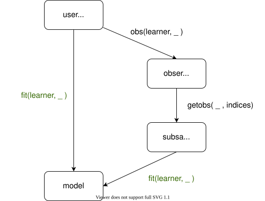

```@raw html
<script async defer src="https://buttons.github.io/buttons.js"></script>

<div style="font-size:1.4em;font-weight:bold;">
  <a href="anatomy_of_an_implementation"
    style="color: #389826;">Tutorial</a>           &nbsp;|&nbsp;
  <a href="common_implementation_patterns"
    style="color: #9558B2;">Patterns</a>           &nbsp;|&nbsp;
  <a href="reference"
    style="color: #9558B2;">Reference</a>
</div>

<span style="color: #9558B2;font-size:4.5em;">
LearnAPI.jl</span>
<br>
<span style="color: #9558B2;font-size:1.6em;font-style:italic;">
A base Julia interface for machine learning and statistics </span>
<br>
<br>
```

LearnAPI.jl is a lightweight, functional-style interface, providing a collection of
[methods](@ref Methods), such as `fit` and `predict`, to be implemented by algorithms from
machine learning and statistics, some examples of which are listed [here](@ref
patterns). A careful design ensures algorithms implementing LearnAPI.jl can buy into
functionality, such as external performance estimates, hyperparameter optimization and
model composition, provided by ML/statistics toolboxes and other packages. LearnAPI.jl
includes a number of Julia [traits](@ref traits) for promising specific behavior.


## Sample workflow

Suppose `forest` is some object encapsulating the hyperparameters of the [random forest
algorithm](https://en.wikipedia.org/wiki/Random_forest) (the number of trees, etc.). Then,
a LearnAPI.jl interface can be implemented, for objects with the type of `forest`, to
enable the basic workflow below. In this case data is presented following the
"scikit-learn" `X, y` pattern, although LearnAPI.jl supports other data patterns.

```julia
# `X` is some training features
# `y` is some training target
# `Xnew` is some test or production features

# List LearnaAPI functions implemented for `forest`:
@functions forest

# Train:
model = fit(forest, (X, y))

# Generate point predictions:
ŷ = predict(model, Xnew) # or `predict(model, Point(), Xnew)`

# Predict probability distributions:
predict(model, Distribution(), Xnew)

# Apply an "accessor function" to inspect byproducts of training:
LearnAPI.feature_importances(model)

# Slim down and otherwise prepare model for serialization:
small_model = LearnAPI.strip(model)
serialize("my_random_forest.jls", small_model)
```

`Distribution` and `Point` are singleton types owned by LearnAPI.jl. They allow
dispatch based on the [kind of target proxy](@ref proxy), a key LearnAPI.jl concept.
LearnAPI.jl places more emphasis on the notion of target variables and target proxies than
on the usual supervised/unsupervised learning dichotomy. From this point of view, a
supervised learner is simply one in which a target variable exists, and happens to
appear as an input to training but not to prediction.

## Data interfaces and front ends

Algorithms are free to consume data in any format. However, this means LearnAPI.jl should
provide meta-algorithms, such as cross-validation, some means of subsampling observations,
without repeating unnecessarily internal conversions of input data into the form needed by
core algorithms. LearnAPI.jl's solution to this problem is to provide a method called
[`obs(learner, data)`](@ref data_interface) (read as "observations") which exposes to the
user, and whence third party meta-algorithms, a learner-specific, "internal"
representation of the "external" `data` ordinarily supplied to `fit` (or `predict`) by the
user. For example, `data` might be a table with mixed column types, but `obs(learner,
data)` consists only of numerical arrays. Unless the implementation opts out, such a
representation is additionally guaranteed to implement a standard interface for accessing
individual observations, the [MLCore.jl](https://github.com/JuliaML/MLCore.jl)
`getobs/numobs` API (previously provided by MLUtils.jl) which is here tagged as
[`LearnAPI.RandomAccess()`](@ref). These can then be subsampled, without caring about the
details of the representation, as in cross-validation. Moreover, such "observations"
(sampled or not) can be passed on to `fit` and `predict`, instead of the original external
form of `data`. In other words, `obs` factors out of `fit` the internal preprocessing of
user-supplied data, but in a way that ensures the intercepted, internal form of data
implements a standard subsampling API.



> Two pathways to generating a model, with and without subsampling. Here `obs` is provided
> by an LearnAPI.jl learner implementation, while `getobs` is a MLCore.jl method for
> subsampling.

If the input consumed by the algorithm already implements the
[`LearnAPI.RandomAccess()`](@ref) interface (tables, arrays, etc.)  then overloading `obs`
is completely optional, as LearnAPI.jl provides a no-operation fallback. Plain iteration
interfaces, with or without knowledge of the number of observations, can also be
specified, to support, e.g., data loaders reading images from disk.

In the typical case, a new implementation can avoid actually coding data preprocessing by
using a canned data front end (implementations of [`obs`](@ref)). These are provided by
the [LearnDataFrontEnds.jl](https://juliaai.github.io/LearnDataFrontEnds.jl/stable/)
package.

## Learning more

- [Anatomy of an Implementation](@ref): informal tutorial introducing the main actors in a
  new LearnAPI.jl implementation, including a **Quick Start** for new implementations.

- [Reference](@ref reference): official specification

- [Common Implementation Patterns](@ref patterns): implementation suggestions for common,
  informally defined, algorithm types

- [Testing an Implementation](@ref)
